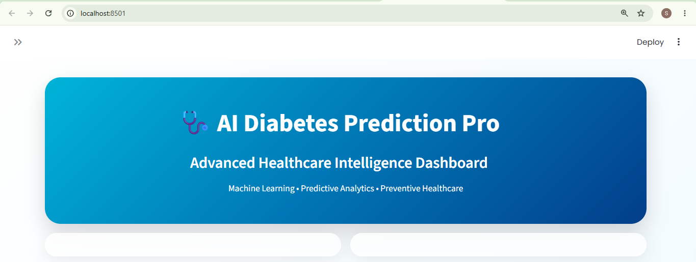
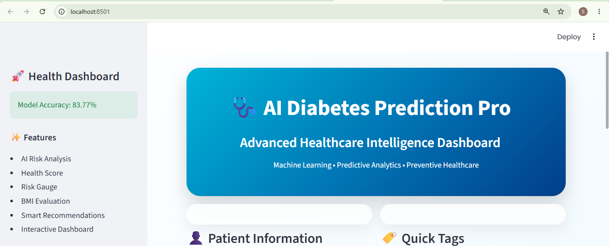
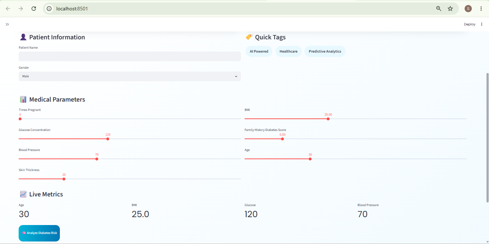
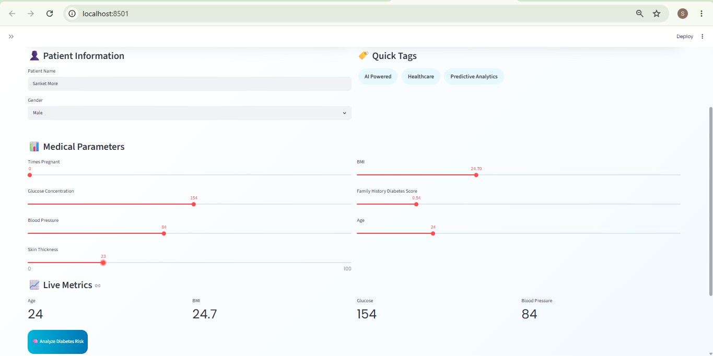
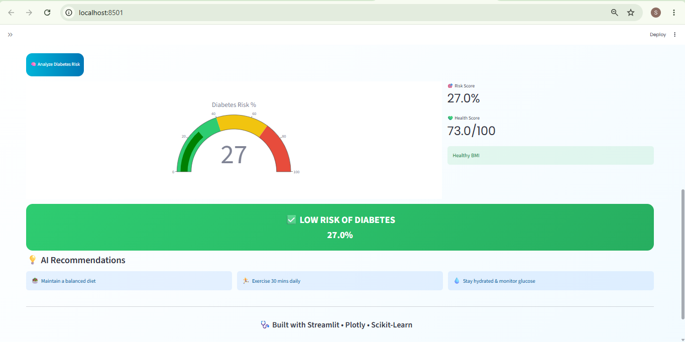

# 🩺 AI Diabetes Prediction System

An advanced Machine Learning-powered healthcare application that predicts whether a patient is at risk of diabetes based on medical parameters. The application provides risk analysis, health insights, and an interactive dashboard built using Streamlit.

---

## 📌 Project Overview

Diabetes is one of the most common chronic diseases worldwide. Early prediction can help patients take preventive measures and improve their lifestyle.

This project uses a Machine Learning model trained on the Pima Indians Diabetes Dataset to predict diabetes risk based on patient health metrics.

The application features a modern healthcare dashboard with interactive visualizations, risk scoring, and personalized recommendations.

---

## ✨ Features

### 🧠 Machine Learning Prediction

* Predicts whether a patient is diabetic or not.
* Uses a trained Logistic Regression model.
* Provides real-time risk assessment.

### 📊 Interactive Dashboard

* Modern healthcare-themed UI.
* Interactive sliders for patient inputs.
* Dynamic risk visualization.

### 🎯 Risk Analysis

* Diabetes risk percentage.
* Health score calculation.
* Risk gauge chart using Plotly.

### 📈 Health Insights

* BMI evaluation.
* Personalized health recommendations.
* Patient summary dashboard.

### 🎨 Premium UI

* Glassmorphism design.
* Gradient healthcare theme.
* Interactive components.
* Responsive layout.

---

## 📷 Screenshots

### Home Page



---



---

### Patient Information



---



---

### Prediction Result


---

## 🏗️ Project Structure

```text
Diabetes-Prediction-App/
│
├── app.py
├── diabetes_model.pkl
├── requirements.txt
├── README.md
│
└── screenshots/
    ├── home.png
    ├── prediction.png
    └── result.png
```

---

## 🧾 Input Features

The model uses the following medical parameters:

| Feature              | Description                 |
| -------------------- | --------------------------- |
| TimesPregnant        | Number of pregnancies       |
| GlucoseConcentration | Blood glucose concentration |
| BloodPrs             | Blood pressure              |
| SkinThickness        | Skin fold thickness         |
| BMI                  | Body Mass Index             |
| DiabetesFunct        | Diabetes pedigree function  |
| Age                  | Patient age                 |

---

## 🎯 Target Variable

| Value | Meaning      |
| ----- | ------------ |
| 0     | Non-Diabetic |
| 1     | Diabetic     |

---

## 📊 Model Performance

| Metric    | Score  |
| --------- | ------ |
| Accuracy  | 83.77% |
| Precision | 73.68% |
| Recall    | 65.12% |
| F1 Score  | 69.14% |

---

## 🛠️ Technologies Used

### Programming Language

* Python

### Machine Learning

* Scikit-Learn
* Logistic Regression

### Data Processing

* NumPy
* Pandas

### Visualization

* Plotly

### Deployment

* Streamlit

---

## ⚙️ Installation

Clone the repository:

```bash
git clone https://github.com/YOUR_USERNAME/Diabetes-Prediction-App.git

cd Diabetes-Prediction-App
```

Install dependencies:

```bash
pip install -r requirements.txt
```

Run the application:

```bash
streamlit run app.py
```

---

## 📈 Workflow

```text
Patient Information
        ↓
Medical Parameters
        ↓
Data Preprocessing
        ↓
Machine Learning Model
        ↓
Risk Prediction
        ↓
Health Analysis
        ↓
Recommendations
```

---

## 💡 Health Recommendations

The application provides recommendations such as:

* 🥗 Maintain a healthy diet
* 🏃 Exercise regularly
* 💧 Stay hydrated
* 😴 Get adequate sleep
* 🩺 Monitor blood sugar levels
* 🚭 Avoid smoking

---

## 🎓 Learning Outcomes

Through this project:

* Built a complete Machine Learning pipeline.
* Performed data preprocessing and feature engineering.
* Trained and evaluated a classification model.
* Developed an interactive web application using Streamlit.
* Visualized healthcare analytics using Plotly.
* Deployed an ML application for real-world usage.

---

## 👨‍💻 Author

**Sanket More**
